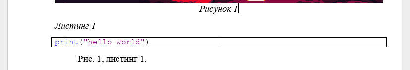

# md2gost

Скрипт для генерации docx отчета в соответствии с ГОСТ из markdown файла.

## Содержание
<!-- TOC -->
* [md2gost](#md2gost)
  * [Содержание](#содержание)
  * [Основные возможности](#основные-возможности)
  * [Пример](#пример)
  * [Установка](#установка)
  * [Использование](#использование)
  * [Фичи](#фичи)
    * [Шаблон](#шаблон)
    * [Добавление титульной страницы](#добавление-титульной-страницы)
    * [Номер первой страницы](#номер-первой-страницы)
    * [Подписи рисунков, листингов, таблиц](#подписи-рисунков-листингов-таблиц)
    * [Ссылки (кросс-референсинг)](#ссылки-кросс-референсинг)
    * [Заголовки для основных разделов](#заголовки-для-основных-разделов)
    * [Генерация содержания](#генерация-содержания)
    * [Подсветка синтаксиса в листингах](#подсветка-синтаксиса-в-листингах)
    * [Импорт кода в листингах](#импорт-кода-в-листингах)
<!-- TOC -->

## Основные возможности
- Генерация отчета;
- Добавление титульной страницы в формате docx;
- Генерация интерактивного содержания;
- Поддержка сквозной нумерации и кросс-референсинга;
- Автоматическая расстановка рисунков, продолжений таблиц и листингов и т.д.

## Пример
Markdown-файл: [example.md](https://github.com/witelokk/md2gost/blob/main/examples/example.md).

Сгенерированный файл в zip архиве (команда `python -m md2gost --syntax-highlighting example.md`): [example.zip](https://nightly.link/witelokk/md2gost/workflows/example-generator/main/example.zip?h=f65c99d31a9379f44fcc6e923de4a735a271d5aa).

## Установка
```bash
pip install --upgrade git+https://github.com/witelokk/md2gost.git@main
```

Если ваша система приняла стандарт [PEP 668](https://peps.python.org/pep-0668/), используйте [pipx](https://pypa.github.io/pipx/):
```bash
pipx install git+https://github.com/witelokk/md2gost.git@main
```

> [!IMPORTANT]
> Также  в системе должны быть установлены шрифты **Times New Roman** и **Courier New** (можно поменять в шаблоне).

## Использование
```
(python -m ) md2gost [-h] [-o OUTPUT] [-T TITLE] [--title-pages TITLE_PAGES] [--syntax-highlighting | --no-syntax-highlighting] [--debug] [filenames ...]
```

При отсутствии флага -o, сгенерированный отчет будет иметь имя с названием исходного файла и расширением .docx.

## Фичи
Скрипт использует [Github Flavored Markdown](https://github.github.com/gfm/) + синтаксис, описанный ниже.

### Шаблон
Чтобы поменять какие-то параметры в документе (отступы, размер шрифта и т.д.), скачайте [шаблон](https://github.com/witelokk/md2gost/raw/main/md2gost/Template.docx), настройте его
и укажите как параметр `--template`(или `-t`): `md2gost report.md --template my_template.docx`

### Добавление титульной страницы
Чтобы добавить титульную страницу, используйте флаг `--title`(`-T`) с путем до файла с титульной страницей (в формате docx).

Пример: `md2gost report.md --title title.docx`.

### Номер первой страницы
Чтобы изменить номер первой страницы, используйте параметр `--first-page` (например `--first-page 3`).

### Подписи рисунков, листингов, таблиц
Рисунки:
```markdown

```

Таблицы:
```markdown
% Caption text

| a | b | c |
|---|---|---|
| a | b | c |
```

Листинги:
~~~markdown
% Caption text

```python
print("hello world")
```
~~~

Формулы:
```markdown
%uniquename

$$
2 + 2 = 4
$$
```

### Ссылки (кросс-референсинг)
Чтобы вставить кликабельный номер картинки/листинга/etc, используйте
~~~markdown


%code

```python
print("hello world")
```

Рис. @pic, листинг @code.
~~~

Результат:


### Заголовки для основных разделов
Для того чтобы у заголовка не было сквозной нумерации (например для заголовка Содержание), используйте 
```markdown
# *СОДЕРЖАНИЕ
```

### Генерация содержания
```markdown
[TOC]
```

### Подсветка синтаксиса в листингах
Используйте флаг ```--syntax-highlighting```.

### Импорт кода в листингах
~~~markdown
```python code.py
```
~~~
`code.py` - путь до файла с кодом.
